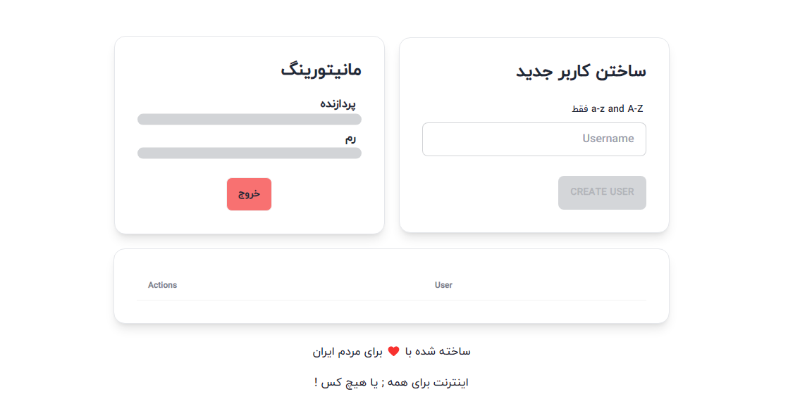

# OpenVPN • WireGuard فیلتر شکن

سلام من علیرضا هستم یه برنامه نویس فرانت اند :)
من کد های بک اند این پروژه رو برداشتم و با یک ui بسیار زیبای فارسی براتون ادغام کردم !
تمام هدفم این بوده به قدری ساده باشه که همه افراد بتونن این پروژه رو روی سرور لینوکسی خودشون بدون هیچ دانشی راه اندازی کنن.
به زودی توی یوتویوب آموزشش رو میزارم و لینکس رو اینجا قرار میدم !

```bash
sudo wget https://raw.githubusercontent.com/alirezabayat313/vpn/main/setup.sh -O setup.sh && sudo chmod +x setup.sh && sudo bash setup.sh
```

### مهم

-   پورت 80 و 443 رو اگه میخواید از وی پی ان استفاده کنید باز کنید
-   به دامنه نیاز دارید

### پنل ادمین


